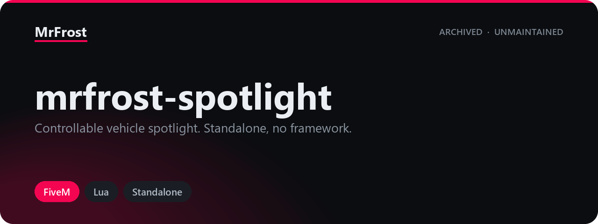

  

# mrfrost-spotlight

  
  
  
  
  
  

A driver-operated spotlight for emergency vehicles in FiveM. Anyone sitting in a
class 18 (Emergency) vehicle can switch a beam on and aim it with the arrow
keys, and every other player on the server sees the same beam in the same place.

*Published as-is and no longer actively maintained — issues and pull requests may not get a response.*

## Background

These scripts were written for a private GTA V roleplay server and ran there in
production. They are published here so the work stays available rather than
sitting on a disk, and so anyone who finds them useful can build on them.

Because they were built for one specific server rather than for general release,
they may need adapting before they drop cleanly into another
setup. This one is standalone and pulls in no other resources.

## Requirements

- A FiveM server (`fx_version "cerulean"`).
- Lua 5.4, which the manifest enables with `lua54 "on"`.

There are no other requirements. The resource is standalone: it uses only base
game and CitizenFX natives, and does not reference a framework, an inventory, a
targeting resource, or a database.

## Installation

1. Copy the `mrfrost-spotlight` folder into your server's `resources/` directory.
2. Add `ensure mrfrost-spotlight` to your `server.cfg`.

No SQL, items or framework setup is needed. Key bindings register themselves the
first time a player loads the resource and can then be changed per player under
*Settings > Key Bindings > FiveM* in the pause menu.

## Usage

The spotlight only turns on for a vehicle whose class is 18 (Emergency), and
never for planes or helicopters.

| Command | Arguments | Default key | Description |
| --- | --- | --- | --- |
| `/spotlight` | none | `End` | Toggles the spotlight on the vehicle you are sitting in. |
| `/movespotlight up` | `up` | `Up Arrow` | Raises the beam by `Config.MovingSpeed` degrees. |
| `/movespotlight down` | `down` | `Down Arrow` | Lowers the beam by `Config.MovingSpeed` degrees. |
| `/movespotlight left` | `left` | `Left Arrow` | Turns the beam left by `Config.MovingSpeed` degrees. |
| `/movespotlight right` | `right` | `Right Arrow` | Turns the beam right by `Config.MovingSpeed` degrees. |

The aim is stored as an offset from the vehicle's own heading, so the beam keeps
pointing the same way relative to the car as the car turns. Both axes are
limited to `Config.MaxRotation` degrees in either direction.

## Configuration

Everything lives in `shared/config.lua`, which is loaded as a shared script and
listed under `escrow_ignore` so it stays editable. The command names, the two
values that shape the beam and the default keys are the parts most servers
change.

| Key | Default | Description |
| --- | --- | --- |
| `Config.MaxRotation` | `90` | Maximum degrees the beam may be turned away from the vehicle's forward axis, on both axes. |
| `Config.MovingSpeed` | `5` | Degrees applied per key press, not per second. |
| `Config.SpotlightSize` | `20.0` | Radius of the cone passed to `DrawSpotLight`. |
| `Config.SpotlightColor` | `255, 255, 255` | Beam colour as `Red`, `Green`, `Blue` in the 0-255 range. |
| `Config.Commands.Toggle` | `"spotlight"` | Name of the toggle command. |
| `Config.Commands.Rotate` | `"movespotlight"` | Name of the aim command; the direction is passed as its first argument. |
| `Config.DefaultKeybinds` | `END`, arrow keys | Keys suggested to a player the first time they run the resource. |
| `Config.Lang` | English labels | Text shown next to each binding in the Key Bindings menu. |

See [docs/configuration.md](docs/configuration.md) for every key, its type and
the values that are currently hardcoded rather than configurable.

## Events

The resource registers no exports. It uses three net events, all internal to
itself — they are how the client and server halves keep the shared state in
step, not an API other resources are expected to call.

| Event | Direction | Arguments | Purpose |
| --- | --- | --- | --- |
| `spotlight:toggle` | client to server | `vehicleId` (network id), `active` (boolean) | Sets the on/off state for one vehicle, keeping its current aim. |
| `spotlight:updateHeadingPitch` | client to server | `vehicleId` (network id), `headingOffset` (number), `pitchOffset` (number) | Stores a new aim for one vehicle. |
| `spotlight:syncSpotlights` | server to client | `spotlights` (table keyed by network id) | Replaces the receiving client's copy of the whole spotlight table. |

Neither server handler checks that the sender is actually in the vehicle it
names; see [docs/known-issues.md](docs/known-issues.md) before exposing this on
a busy server.

## Documentation

| Page | Contents |
| --- | --- |
| [docs/configuration.md](docs/configuration.md) | Every configuration key, its type, default and effect. |
| [docs/known-issues.md](docs/known-issues.md) | Bugs, rough edges and hardcoded values found while reading the source. |

## Licence

[GPL-3.0](LICENSE)
